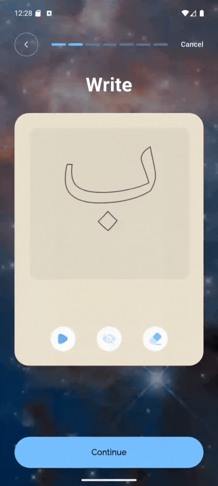

# 📱 Omermjamal – Android App QA Report

## 📌 Project Overview
The **Omermjamal** app is a comprehensive Quran learning platform, designed for all levels from beginner to advanced. It incorporates **interactive exercises, gamification, AI-powered voice recognition**, and **multi-language support** to enhance user learning.

As an **SQA Engineer**, I conducted **UI & Functional Testing** on **every module** of the app, ensuring alignment with the **client-approved Figma design** and functional requirements.

---

## 🛠 Key Client Features Tested

### 1. User Registration & Profile
- Sign-Up/Login via Email & Social Media
- Personalized Profile with Achievements & Completed Lessons
- Multi-language Support

### 2. Progressive Learning Structure
- Levels from Hijaiyah to Full Verses
- Gamified Lessons with Rewards

### 3. Interactive Exercises
- Letter & Word Tracing
- Listening & Pronunciation with AI Feedback
- Fill-in-the-Blank, Matching Games & Quizzes

### 4. Quran-Specific Content
- Surah-based Lessons (Al-Fatihah, Ayatul Kursi)
- Tajweed Rules with Color-Coded Text
- Transliteration & Translation Support

### 5. Gamification & Engagement
- Streaks, Badges, Leaderboards, Daily Challenges

### 6. Voice Recognition
- Recitation Practice with Real-time Feedback

### 7. Progress Tracking
- Milestones, Progress Graphs, Custom Learning Paths

### 8. Offline & Accessibility
- Downloadable Lessons
- Adjustable Recitation Speeds

### 9. Community Features
- Friends, Groups, Forums, Seasonal Challenges

### 10. Multimedia Integration
- Multiple Reciters, Video Tutorials

### 11. Notifications
- Push Reminders for Daily Practice

---

## 📋 Scope of QA Work
- **UI Testing** against Figma Design
- **Functional Testing** for all modules
- **Bug Reporting** in structured format
- **Client Collaboration** via meetings
- **Re-testing** after bug fixes
- **Final Sign-off** before release

---

## 🎨 Figma Design
[🔗 View Client-Approved Figma Design](https://www.figma.com/design/rEfkxbGX6xnSWjCvNa08pL/Omermjamal-%7C%7C-Web_genious-%7C%7C-FO42774055FC8?node-id=24141-2428&t=aSLOG3KjRnC9Rxug-0)

---

## 🐞 Bug Report
All bugs were logged in a structured Google Sheet and shared with the development team.

**Bug Report Link:** [📄 View Bug Report](https://docs.google.com/spreadsheets/d/1fpaEGH6DULiYJzFtky_OmgiPzMXrb3Wn9O4O2TYbmj8/edit?usp=sharing)

---

### 📑 Demo Bug Report Structure
| Bug ID | Module | Feature | Bug Type | Bug Title | Bug Description | Steps to Reproduce | Actual Result | Expected Result | Issue Labels | Severity | Attachment | Dev Status | Tester | Tester Comment | Developer Comment | Re-testing | Date |
|--------|--------|---------|----------|-----------|-----------------|--------------------|---------------|-----------------|--------------|----------|------------|------------|--------|----------------|-------------------|------------|------|
| 001    | Registration | Email Sign-Up | UI Bug | Misaligned Button | Sign-up button overlaps footer on small devices | 1. Open app on 5" device   2. Go to Registration screen   3. Observe button position | Button overlaps footer | Button should be properly aligned above footer | UI, Mobile | Major | screenshot.png | Fixed | Tester Name | Verified in v1.0.1 | Corrected in layout | Yes | 2025-08-05 |

---

## 🖼 Screenshots (click to see the screenshots) &gt;

  
Show / Hide Screenshots

  

      
      
      
      
      
      
      
      
      
      
      
      
  

  *(Swipe/scroll horizontally to view more screenshots)*

---

## 📊 Tools & Platforms Used
- **Figma** – Design Reference
- **Google Sheets** – Bug Tracking
- **Android Emulator** – Device Testing
- **Real Device** – Functional Testing (Android 11)

---

## 📅 Testing Timeline
- **Test Cycle 1:** Initial UI & Functional Testing
- **Test Cycle 2:** Bug Fix Verification
- **Final Cycle:** Client Acceptance Testing (CAT)

---

## ✅ Final Outcome
- All modules tested and verified
- UI aligned with client-approved design
- All critical & major bugs resolved
- Project successfully submitted to the client

---

## 📬 Contact
For inquiries about this QA project:  
**Name:** Md Abdur Rahaman Tutul  
**Role:** SQA Engineer  
